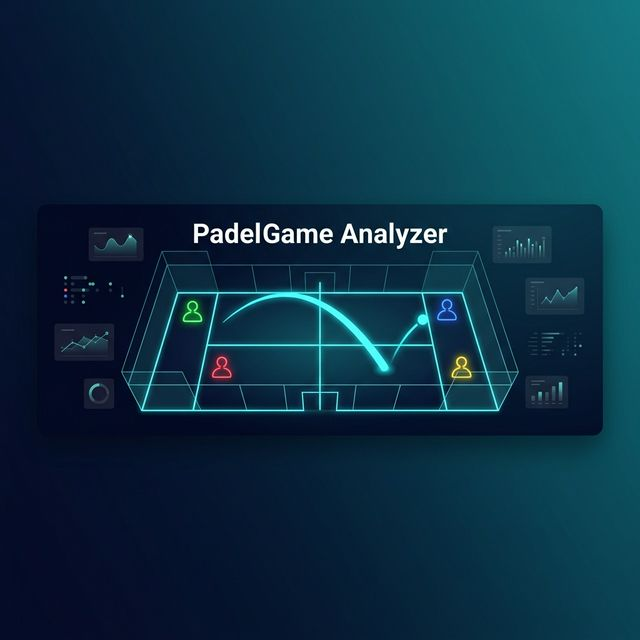
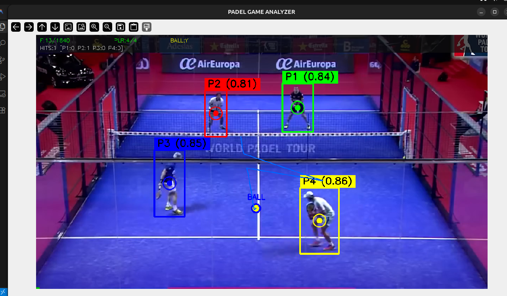
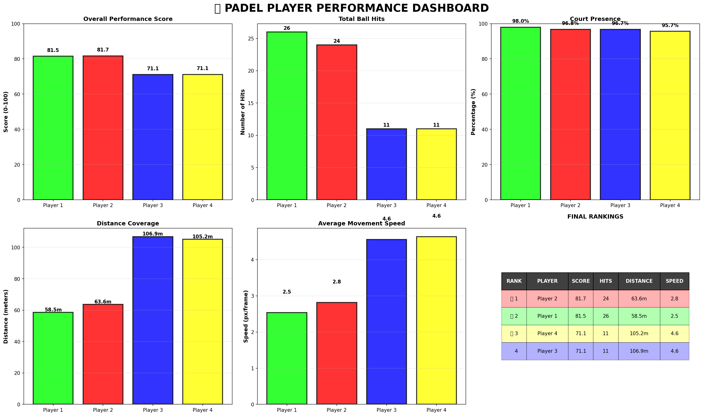
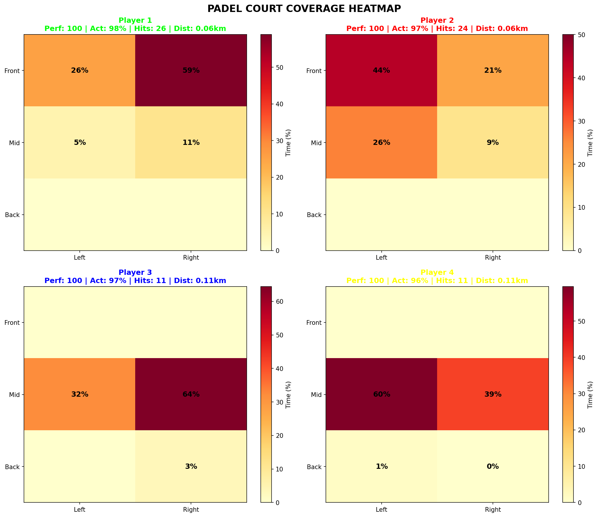
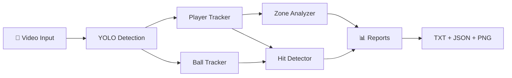

<p align="center">
  
</p>

<h1 align="center">🎾 Padel Game Analyzer</h1>

<p align="center">
  <strong>AI-powered padel match analysis using YOLO — real-time player tracking, ball hit detection & performance analytics</strong>
</p>

<p align="center">
  
  
  
  
</p>

---

## 📸 Demo

<p align="center">
  
</p>

<p align="center"><em>Real-time detection: 4 players with stable IDs (P1-P4) + ball tracking with trajectory trail</em></p>

<details>
<summary>📊 More Screenshots</summary>

### 🎯 Ball Hit Detection
<p align="center">
  
</p>

### 🏃 Court Coverage Analysis
<p align="center">
  
</p>

### 📊 Performance Dashboard
<p align="center">
  
</p>

### 🔥 Court Coverage Heatmap
<p align="center">
  
</p>

</details>

---

## ✨ Features

| Feature | Description |
|---------|------------|
| 🏃 **Player Tracking** | Stable ID assignment (P1-P4) using Hungarian algorithm — IDs never swap |
| 🎾 **Ball Detection** | YOLO-based ball tracking with trajectory trail visualization |
| 💥 **Hit Detection** | Velocity spike analysis to detect who hit the ball and when |
| 📊 **Performance Score** | Weighted 0-100 score combining presence, hits, speed & distance |
| 🗺️ **Court Zone Analysis** | Track player coverage across 6 court zones |
| 🔥 **Heatmap Generation** | Visual heatmaps showing where each player spent time |
| 📈 **Dashboard** | Auto-generated matplotlib dashboard with charts & rankings |
| 🖥️ **Live Display** | Real-time OpenCV window with overlays, pause/resume controls |

---

## 🚀 Quick Start

### 1. Clone & Setup

```bash
git clone https://github.com/user171125/padel-game-analyzer.git
cd padel-game-analyzer

# Create virtual environment
python3 -m venv .venv
source .venv/bin/activate

# Install dependencies
pip install -r requirements.txt
```

### 2. Add Models

Place your YOLO weights in the `models/` directory:
```
models/
├── player_detection_model.pt    # Player detection model
└── ball_detetcion.pt            # Ball detection model
```

### 3. Run Analysis

```bash
# With live video display
python run_analysis.py --video videos/match.mp4 --device cpu --live

# Headless (no display)
python run_analysis.py --video videos/match.mp4 --device cpu

# With GPU (if available)
python run_analysis.py --video videos/match.mp4 --device 0 --live
```

### 4. View Results

All results are saved to `output/`:
```
output/
├── ball_hit_statistics.json       # Hit data per player
├── ball_hit_statistics.txt        # Human-readable hit report
├── court_coverage_stats.json      # Coverage metrics
├── court_coverage_report.txt      # Coverage report
├── player_performance_metrics.json # Performance scores
├── PLAYER_PERFORMANCE_REPORT.txt  # Final rankings
├── COURT_COVERAGE_HEATMAP.png     # Zone heatmap
└── PLAYER_PERFORMANCE_DASHBOARD.png # Charts dashboard
```

---

## 🏗️ Architecture

```
padel-game-analyzer/
├── run_analysis.py          # 🎯 Unified entry point
├── config.py                # ⚙️ All parameters + CLI args
├── trackers/
│   ├── player_tracker.py    # 🏃 StablePlayerTracker (Hungarian algorithm)
│   ├── ball_tracker.py      # 🎾 BallTracker (trajectory + smoothing)
│   └── hit_detector.py      # 💥 BallHitDetector (velocity spike analysis)
├── analyzers/
│   ├── zone_analyzer.py     # 🗺️ Court zone coverage analysis
│   └── performance.py       # 📊 Performance score calculator
├── reporters/
│   ├── text_report.py       # 📝 TXT report generation
│   └── dashboard.py         # 📈 Matplotlib charts & heatmaps
├── models/                  # 🤖 YOLO model weights
├── data/                    # 📁 Court boundary definitions
├── videos/                  # 🎥 Input match videos
├── output/                  # 📤 Generated results
└── assets/                  # 🖼️ README screenshots
```

---

## ⚙️ Configuration

All parameters are in [`config.py`](config.py). Key settings:

| Parameter | Default | Description |
|-----------|---------|-------------|
| `PLAYER_CONF_THRESHOLD` | `0.3` | Min confidence for player detection |
| `BALL_CONF_THRESHOLD` | `0.15` | Min confidence for ball detection |
| `HIT_VELOCITY_THRESHOLD` | `30` | Velocity change to detect a hit |
| `HIT_PLAYER_DISTANCE` | `150` | Max px distance for hit attribution |
| `TRACKER_MAX_MISSING` | `20` | Frames to keep player slot open |

### CLI Options

```
--video         Path to input video (required)
--device        Inference device: 'cpu' or '0' for GPU (default: cpu)
--live          Show live OpenCV window
--output        Output directory (default: output/)
--player-model  Path to player YOLO model
--ball-model    Path to ball YOLO model
--court-bounds  Path to court boundaries JSON
```

---

## 📊 Sample Output

```
🏆 Performance Rankings:
   🥇 Player 2: 81.7/100 (24 hits, 96.8% presence)
   🥈 Player 1: 81.5/100 (26 hits, 98.0% presence)
   🥉 Player 4: 71.1/100 (11 hits, 95.7% presence)
      Player 3: 71.1/100 (11 hits, 96.7% presence)

🎾 Total Ball Hits: 72
   Player 1: 26 hits
   Player 2: 24 hits
   Player 3: 11 hits
   Player 4: 11 hits
```

---

## 🔧 How It Works



1. **Detection** — YOLO models detect players and ball in each frame
2. **Tracking** — Hungarian algorithm maintains stable player IDs; ball trajectory is smoothed
3. **Hit Detection** — Velocity spikes in ball trajectory are matched to nearest player
4. **Analysis** — Court zones, distances, speeds, and performance scores are computed
5. **Reports** — Text reports, JSON data, heatmaps, and dashboards are generated

---

## 🤝 Contributing

1. Fork the repo
2. Create your feature branch (`git checkout -b feature/amazing-feature`)
3. Commit changes (`git commit -m 'Add amazing feature'`)
4. Push to branch (`git push origin feature/amazing-feature`)
5. Open a Pull Request

---

## 📄 License

This project is licensed under the MIT License — see the [LICENSE](LICENSE) file for details.

---

<p align="center">
  By Shiv Kumar -- (MindRoots pvt ltd)
</p>
